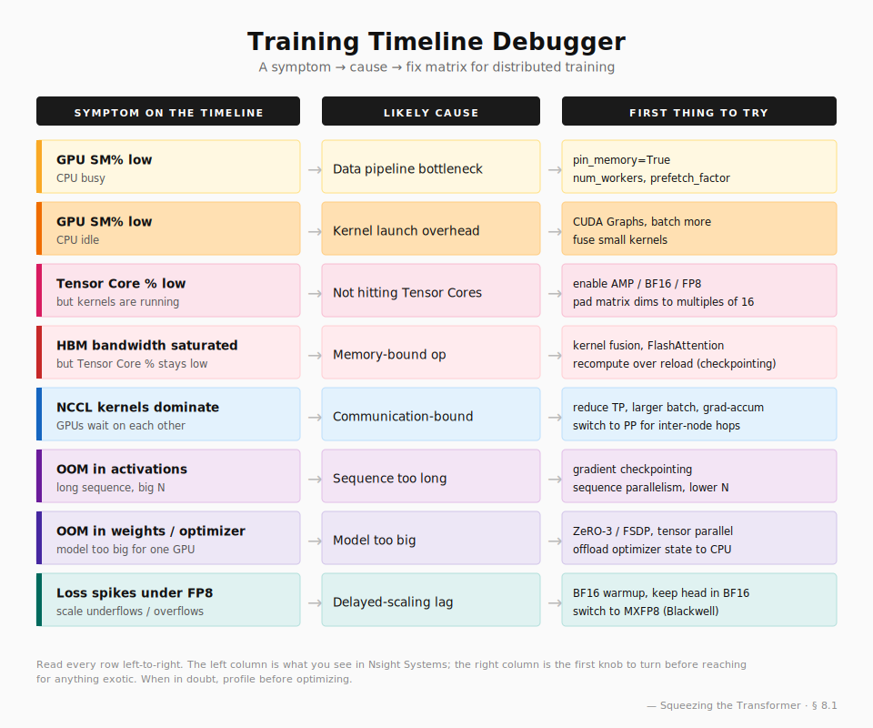

> **TL;DR**: I worked through NVIDIA's Profiling-and-Distributed-Training bootcamp end-to-end. This post is my attempt to compress 11 notebooks of hands-on labs into a coherent story about how a Transformer training step gets accelerated by **~10×** (from a naïve PyTorch baseline to a TP-aware FP8 pipeline). Along the way I'll record the moments where my intuition was wrong, the optimizations that turned out to be free, and what all of this means if your end goal is to train a **world model** — i.e., a network whose job is to _imagine the future_, not classify cats.

---

## 1. The framing

Whenever I look at a training script that's "too slow", I find myself reaching for the same three knobs in escalating order of desperation: _throw more GPUs at it_, _use mixed precision_, _try FlashAttention_. This usually buys 2–3× before things get weird — kernels stall, NCCL hangs, loss spikes, OOM appears in places where it shouldn't.

The bootcamp is interesting because it forces you to confront these failure modes _systematically_, by traversing the optimization stack from the bottom up:

$$
\underbrace{\text{Topology}}_{\text{NVLink, IB, NUMA}} \;\to\; \underbrace{\text{Communication}}_{\text{NCCL, all-reduce}} \;\to\; \underbrace{\text{Parallelism}}_{\text{DDP, TP, PP, SP}} \;\to\; \underbrace{\text{Kernels}}_{\text{FlashAttn, FP8, fusion}}
$$

Each layer multiplies the previous one. Skipping a layer doesn't just leave performance on the table; it actively breaks the layers above (e.g., naïve TP with no NCCL group config will silently desynchronize FP8 scales, and you'll spend a week debugging "why does my loss diverge on 8 GPUs but not 4").

So this post mirrors that traversal. I'll keep the math light where it'd be redundant (anyone reading this has seen $\nabla_\theta \mathcal{L}$ before) and dwell instead on the *engineering geometry* — i.e., which dimension is being sliced, what touches HBM, what gets recomputed.

---

## 2. Problem setup

Let $f_\theta$ be a Transformer layer with hidden size $d$, FFN expansion $4d$, sequence length $N$, batch $B$, and $H$ attention heads. A single forward + backward pass has cost roughly:

$$
C(f_\theta) \approx \underbrace{12 \, B N d^2}_{\text{linears}} \;+\; \underbrace{4 \, B N^2 d}_{\text{attention}} \;+\; \underbrace{2\,B N \cdot 4 d^2}_{\text{FFN}}
$$

For the bootcamp's reference configuration ($d=4096$, $N=2048$, $B=4$, $H=32$), this is **~10 TFLOPs per layer per step**[^tflops], which an H100 should chew through in ~10 ms at theoretical FP16 peak. The naïve PyTorch baseline takes **25.25 ms**. That ~2.5× gap is what we are going to claw back.

[^tflops]: Forward ≈ 3 TFLOPs from the three terms above (linears 1.65 + attention 0.27 + FFN 1.1). Backward ≈ 2× forward by the standard rule, giving fwd+bwd ≈ 9–10 TFLOPs. H100 FP16 Tensor Core peak ≈ 989 TFLOPs/s dense, so theoretical floor ≈ 10 ms.

The ratio of attention to FFN cost is $\frac{N^2 d}{N d^2} = \frac{N}{d}$. At $N = 2048,\ d = 4096$ this is $\tfrac{1}{2}$ — attention is half of FFN. But this number scales linearly with $N$. **For a world model with $N = 32768$ (a few seconds of video at moderate tokenization), attention is 8× bigger than FFN.** This single fact dominates everything else in this post.

> **Aside.** I think of the FFN-dominant regime as "language model territory" and the attention-dominant regime as "video / world model territory". Most of the FP8 literature targets the former. The optimizations that matter most when you cross into the latter are different (FlashAttention, paged KV cache, ring attention).

---

## 3. The hardware substrate

A training run is a graph of tensor operations laid over a _physical_ graph of compute and bandwidth. The bootcamp opens with a `system-topology` notebook that asks you to query `nvidia-smi topo -m` and stare at the resulting matrix until it stops looking like noise. Three numbers matter:

| Link | Bandwidth | Latency |
|---|---|---|
| **NVLink 4** (intra-node) | 900 GB/s | ~1 µs |
| **PCIe Gen5** (CPU↔GPU) | 64 GB/s | ~5 µs |
| **InfiniBand HDR/NDR** (inter-node) | 200–400 Gb/s ≈ 25–50 GB/s | ~5 µs |

NVLink is ~20× faster than IB. This is the entire reason TP collapses across nodes and PP doesn't. **If your model fits in a single 8-GPU node, you want to keep tensor parallelism inside the node, and use the comparatively-slow IB only for whole-layer transfers (PP) or batched gradient sync (DDP).**

NCCL implements all-reduce with two algorithms[^1]:

- **Ring**: $O(N \cdot \text{message-size}/B)$ — optimal *bandwidth* but bad *latency* (every byte traverses every link).
- **Tree**: $O(\log N \cdot \text{message-size}/B)$ — optimal *latency*, less optimal bandwidth.

NCCL picks automatically based on message size, but you can override with `NCCL_ALGO=Ring` or `NCCL_ALGO=Tree`. In the `multinode` notebook, setting `NCCL_DEBUG=INFO` exposes the algorithm choice in the log, and you can confirm with Nsight Systems that the actual bytes-on-wire match the algorithm. **This is the kind of "obvious in retrospect" sanity check I would never have thought to do without seeing it traced.**

---

## 4. Parallelism, briefly

I want to avoid rehashing the (excellent) Megatron-LM paper[^2], so I'll just record the mental model that finally clicked for me.

There are three orthogonal axes you can shard a Transformer across:

1. **Batch axis** → DDP / FSDP / ZeRO.
2. **Hidden axis** → Tensor Parallel (TP). Slice the FFN columns then rows, slice attention by head.
3. **Layer axis** → Pipeline Parallel (PP). One layer per GPU.

These compose: $\text{GPUs} = \text{DP} \times \text{TP} \times \text{PP}$. The right factorization is determined by bandwidth, not by elegance:

- **DP** is the cheapest communication (one all-reduce per step, on gradients only).
- **TP** is the most expensive (one all-reduce _per layer_, on activations) — which is the reason for the rule of thumb in § 3.
- **PP** is the rarest used because it requires careful micro-batch scheduling (1F1B[^3]) to avoid pipeline bubbles.

For a world model with a long backbone and modest hidden size, my intuition says **DP × PP** is the natural factorization — but the bootcamp doesn't really stress-test PP, so I'm flagging that as an open question for myself.

---

## 5. Seeing the timeline

You cannot optimize what you cannot see. The single most useful skill I picked up from the bootcamp is reading a **Nsight Systems** timeline.

A Nsight timeline is essentially a multi-track musical score. Tracks include:

- **CPU**: Python frames, syscalls, `cudaLaunchKernel` calls.
- **GPU**: actual CUDA kernels with their durations.
- **NVTX**: user-annotated ranges (`with nvtx.range("forward"): ...`).
- **NCCL**: communication kernels, broken down by collective op.
- **GPU Metrics**: SM occupancy, Tensor Core active %, HBM bandwidth — sampled at ~100 Hz.

Reading these is a craft. Three failure-mode patterns to memorize:

> **(a) "GPU is idle while CPU is busy"** — Visible as gaps between CUDA kernels with CPU activity in the gap. Symptom of data pipeline bottleneck. Fix: `pin_memory=True`, `num_workers>0`, `prefetch_factor`.

> **(b) "Tensor Core active % is low"** — The GPU is running but not on Tensor Cores. Likely you're in FP32 or your matrix dimensions aren't multiples of 16. Fix: AMP, pad dimensions.

> **(c) "NCCL kernels dominate the timeline"** — You're communication-bound. Fix: reduce TP factor, increase batch, use gradient accumulation, or move to larger NVLink domain.

The `nsys-application` notebook walks through a concrete case: a DDP training that took **101 s/epoch** baseline, dropped to **62 s/epoch** after `pin_memory + AMP + NVTX`. That's a **1.63× speedup from configuration alone, no algorithmic changes**. It's a humbling reminder that most "slow training" reports are just unprofiled training.

---

## 6. Case study: the FP8 ladder

This is the centerpiece of the bootcamp and the most quantitatively satisfying part. I'll record the full ladder, then deconstruct it.

| Step | Configuration | Mean step time | Δ vs prev |
|---|---|---|---|
| 0 | Pure PyTorch, FP16 | 25.25 ms | — |
| 1 | + Replace `nn.Linear`/`LayerNorm` with TE equivalents | 25.29 ms | **+0%** |
| 2 | + Replace `F.scaled_dot_product_attention` with `te.DotProductAttention` (FlashAttention) | 18.56 ms | **+27%** |
| 3 | + Enable FP8 (hybrid recipe, delayed scaling) | 12.38 ms | **+33%** |
| 4 | + Fused modules (`LayerNormLinear`, `LayerNormMLP`) | 12.19 ms | +2% |
| 5 | + Replace whole layer with `te.TransformerLayer` | 11.26 ms | +8% |

**Total: 2.24× speedup.**

A few things surprised me here.

**Surprise 1: TE substitution alone is free.** Going from `nn.Linear` to `te.Linear` while still running in FP16 changes essentially nothing (~0.04 ms regression, probably noise). The mental model "TE = faster Linear" is wrong. The correct model is **"TE = a Linear that has been instrumented to track amax statistics and accept an FP8 scale, so that _later_ you can enable FP8 with one flag"**. The substitution is _infrastructural_, not _kinetic_.

**Surprise 2: FlashAttention is the single biggest win, and it's not FP8.** Pure BF16 FlashAttention buys 27% — bigger than anything that follows. The mechanism is well-known by now (tiling + recomputation moves attention from $O(N^2)$ HBM accesses to $O(N)$), but seeing it dominate the FP8 step in the empirical ladder is striking. **For long-context models, FlashAttention is not an optimization — it's the price of entry.**

**Surprise 3: FP8 gives 33%, not 2×.** Theoretical FP8 throughput on H100 is 2× BF16. We saw 1.5×. The gap comes from:

- amax collection (`max(|x|)` across the tensor, every step).
- Cast kernels (BF16 → FP8 → BF16 at op boundaries).
- Non-GEMM operations (LayerNorm, residual, activation) still in BF16 — they're a small fraction of FLOPs but a large fraction of _wall time_ because they're memory-bound.
- Attention still BF16 in this configuration.

This is the classic gap between **arithmetic intensity** and **observed speedup**. The Tensor Cores got 2× faster, but the rest of the pipeline didn't, so Amdahl's Law eats the rest. Mental note: **the next big FP8 win comes from FP8 attention, which I'll have to investigate separately because the bootcamp doesn't cover it.**

**Surprise 4: Fusion at the layer boundary is bigger than fusion within a layer.** `Fused Modules` (step 4) saves 0.19 ms. `TransformerLayer` (step 5) saves 0.93 ms — 5× more. The reason is that the _whole layer_ knows more than any individual module: it can share amax statistics across attention output and FFN input, fuse residual into the LN of the next sub-block, and schedule GEMMs across sub-modules. This generalizes a lesson I keep relearning: **the right level of abstraction for fusion is the largest one your compiler can see.**

### 6.1. The shape of FP8 numerics

E4M3 and E5M2 are the two FP8 formats from the NVIDIA / Intel / Arm joint proposal[^4]:

| Format | Exponent bits | Mantissa bits | Max | Min subnormal |
|---|---|---|---|---|
| E4M3 | 4 | 3 | 448 | $2^{-9} \approx 0.002$ |
| E5M2 | 5 | 2 | 57344 | $2^{-16} \approx 1.5\times 10^{-5}$ |

The bootcamp's `Hybrid` recipe uses **E4M3 on the forward pass** (activations and weights — precision matters) and **E5M2 on the backward** (gradients — range matters because they span many orders of magnitude). This is a small but very deliberate design choice; it reflects the empirical observation that gradients are heavier-tailed than activations.

**Delayed scaling** maintains a window of the last $k$ amax values (default $k = 16$) and uses their max to compute the next step's scale:

$$
s_{t+1} = \frac{F_{\max}}{\max_{i \in [t-k+1,\, t]} a_i}, \qquad a_t = \max |x_t|
$$

This *lags by one step* — you cast tensor $x_t$ using a scale computed from $x_{t-1}, x_{t-2}, \ldots$. The lag is what makes it cheap (no synchronization needed inside the GEMM), but it's also what makes it brittle when the distribution shifts fast.

> **Aside.** The MXFP8 format[^5] (per-block scaling, 32 elements per block) is the natural fix. Hopper does delayed scaling; Blackwell does both. If you're starting a new project today, my prior is to default to MXFP8 — it's barely slower and dramatically more robust to distribution drift. More on this in the world-model section.

---

## 7. The little optimizations at the top of the ladder

After the FP8 step, there are a few less famous tricks. They're each small (3–7%), but they stack and they're free.

**FP8 weight caching** (`is_first_microbatch=True/False`). If you do gradient accumulation, the same weight tensor is used across $M$ micro-batches. Without caching, you re-cast weights BF16→FP8 every micro-batch — pure waste. The fix is a flag: cast only on the first micro-batch, reuse the cached FP8 for the rest. Saves ~4%.

**Gradient accumulation fusion** (`fuse_wgrad_accumulation=True`). Standard backward pass produces FP8 weight gradients, which then have to be promoted to FP32 and accumulated into a `main_grad` buffer for the optimizer. TE can write directly into a pre-allocated FP32 `main_grad`, bypassing the cast. Saves ~4%. Requires `fuse_qkv_params=True` because the Q, K, V matrices need to be jointly managed.

**Sequence parallelism**. The LayerNorm and Dropout layers in a TP block are usually replicated — every TP rank does the same LN computation, which is wasteful for activations. Sequence parallelism shards them along the sequence axis. Roughly halves activation memory in the LN regions and adds an all-gather, which is cheap compared to the all-reduce it saves elsewhere.

These three are also "infrastructure" — they enable other optimizations more than they speed up the current step. The pattern I notice across the bootcamp: **every one-flag optimization in TE 2.x assumes you've already done the previous five. The library is designed as a ladder, not a buffet.**

---

## 8. Implications for world models

This is where I personally care most. A world model — whether it's a video diffusion model, a Genie-style action-conditioned generator[^6], or a Dreamer-V3 latent dynamics model[^7] — has a few defining properties that interact non-trivially with everything above:

**(a) Sequence length is the primary scaling axis.** You want to model 32, 64, 256 frames at a time, ideally more. At 256 patches/frame and 64 frames, $N = 16384$. The $O(N^2)$ attention is now ~$32\times$ FFN cost. **FlashAttention is no longer optional; it is the architecture.**

**(b) Distribution shift inside a single sequence.** Unlike LM training, where every token comes from the same data distribution, world models roll out their own predictions and feed them back in. Late timesteps have a distribution that drifts from the data. **This is where delayed scaling becomes dangerous** — the amax history was collected on "early-timestep" activations, so the FP8 scale will under-estimate the range of late-timestep activations, producing overflow / loss spikes. My current recipe:

1. BF16 warmup for the first $N_{\text{warmup}}$ steps until amax history stabilizes.
2. Keep the embedding, final projection, and any output head in BF16.
3. Monitor loss spikes; on detection, restore the last good checkpoint and decrease lr by $0.5\times$.
4. Prefer MXFP8 if hardware allows — its per-block scaling tracks intra-tensor distribution shifts that delayed-scaling cannot.

**(c) Memory pressure is dominated by activations, not weights.** For a 1B-parameter world model with $N = 16384$, $d \approx 2048$ and no gradient checkpointing, the activation tensors easily reach 60+ GB (back-of-envelope: ~24 layers × $N \cdot d \cdot$ const). The weight memory might be 2 GB. **This inverts the usual ZeRO trade-off.** ZeRO-1/2 shard optimizer state and gradients — useful when weight memory matters. For world models I'd reach first for **gradient checkpointing** (recompute activations on backward), then **sequence parallelism**, before bothering with ZeRO.

**(d) Throughput is research budget.** A 2× speedup from FP8 is not a 2× speedup of one run — it's a 2× expansion of the _ablation matrix_ you can fit in a given quarter. For a research project where you don't yet know the right reward shaping, the right CFG schedule, or the right tokenizer, this is the difference between converging on a result and not.

### 8.1. A decision matrix I'm now using



| Symptom on the timeline | Likely cause | First thing to try |
|---|---|---|
| GPU SM % low; CPU busy | Data pipeline | `pin_memory`, more workers, `prefetch_factor` |
| GPU SM % low; CPU idle | Kernel launch overhead | CUDA Graphs, batch more, larger kernels |
| Tensor Core % low | Not on TC | AMP, pad dims to 16 |
| HBM bandwidth saturated | Memory-bound op | Kernel fusion, FlashAttention |
| NCCL kernels dominate | Comm-bound | Reduce TP, larger batch, grad accum, PP instead |
| OOM in activations | Too long sequence | Gradient checkpoint, SP, lower $N$ |
| OOM in weights | Too big model | ZeRO-3, FSDP, TP |
| Loss spikes under FP8 | Scale lag in delayed-scaling | BF16 warmup, MXFP8, BF16 head |

I find this kind of matrix more useful than any specific number, because it's the closest thing I have to a **map between observed symptoms and underlying causes**, and most of the time when I'm stuck, the issue is that I've misdiagnosed the cause.

---

## 9. Things I still don't fully understand

In the spirit of being honest with myself:

**Q1.** _Why is delayed scaling so brittle in long-horizon world model rollouts, and is the per-block MXFP8 actually a sufficient fix?_ I have an intuition (MXFP8 tracks intra-tensor structure that delayed scaling misses) but no empirical validation on a real rollout.

**Q2.** _How much of the FlashAttention win generalizes to FlashAttention-3 with FP8 attention?_ The bootcamp uses BF16 FlashAttention. There are papers showing FP8 FlashAttention[^8] gives another ~1.5× over BF16 FlashAttention on H100. I haven't tried it.

**Q3.** _What's the right factorization for a 7B-param world model on $2 \times 8\times$ H100?_ The bootcamp suggests intra-node TP + inter-node DP, but doesn't stress-test PP, which I suspect is better for long backbones with modest hidden width.

**Q4.** _Is gradient accumulation fusion + FP8 weight caching jointly safe, or do they interact in ways that break the amax statistics?_ The bootcamp shows each in isolation but the docstring warning about non-bitwise-identity is the only acknowledgment of their interaction.

**Q5.** _When is it worth replacing `te.TransformerLayer` with a custom Triton kernel?_ The bootcamp implies "never" — the answer changes if your attention pattern is non-standard (block-sparse, sliding-window, Mamba-hybrid), which is increasingly the case for world models.

---

## 10. Closing thoughts

If I had to compress the entire bootcamp into one sentence: **"performance comes from removing layers of abstraction in the right order"**. The right order is dictated by _what's on the timeline_, not what's in the paper. Profile first, optimize second, and resist the urge to start with the most exotic technique — most of the time, `pin_memory=True` is worth more than FP8.

A second, less obvious lesson: **infrastructure optimizations look free at first because they don't show a speedup, but they're the precondition for the kinetic optimizations later**. Substituting `te.Linear` for `nn.Linear` gives 0% speedup. Then enabling FP8 gives 33%. Without the first step, the second doesn't exist. I want to internalize this when planning research engineering work — _don't measure infrastructure changes by their immediate ROI_.

And finally: **everything here is a means, not an end**. The point of optimizing a Transformer step is to enable a world model that can imagine longer, more coherent futures than what we have today. Every millisecond shaved is another ablation run, another configuration tried, another shot at the thing actually working. That framing is what makes the bootcamp worth the time — not the 2.24× number, but the texture of the optimization landscape it reveals.

---

## Appendix A: 11-notebook quick reference

For my own future re-reading. The main text above is the story arc; this appendix is the lookup table — every concrete command or concept from the bootcamp that I want to be able to grep, organized in the notebook order I went through.

### A.1 `system-topology.ipynb`

- Inspect the per-node topology with `nvidia-smi topo -m`. The matrix entries are codes you need to read fluently:
  - `NV#` — NVLink with `#` links (best)
  - `PIX` — internal PCIe switch
  - `PXB` — PCIe with a bridge
  - `NODE` — same NUMA node, different PCIe root
  - `SYS` — across NUMA / sockets (worst)
- NUMA awareness: pin the DataLoader worker processes to the CPU socket that owns the GPU they feed, otherwise host memory crosses the inter-socket link on every batch.
- The whole point of this notebook is to internalize that **topology is the floor** — no software optimization beats moving the tensor closer in the bandwidth hierarchy.

### A.2 `data-parallelism.ipynb`

- DDP terminology you need cold: **rank** (global GPU index), **local_rank** (within-node index), **world_size** (total GPUs).
- Two architectures for model sync:
  - **Parameter server** — centralized, master/worker, master is a comm bottleneck.
  - **AllReduce** — peer-to-peer, no master. NCCL's Ring AllReduce passes values around in $N{-}1$ rounds.
- `torchrun` flags:
  ```
  torchrun --nproc_per_node=4 --nnodes=2 --node_rank=N \
           --master_addr=10.x.x.x --master_port=1234 script.py
  ```
- Init pattern:
  ```python
  torch.distributed.init_process_group(backend='nccl',
      init_method='env://', world_size=N)
  ```
- Always set `torch.manual_seed` before model init so every rank starts from identical weights.
- `DistributedSampler` partitions the dataset across ranks; call `train_sampler.set_epoch(epoch)` every epoch to reshuffle.
- `nn.DataParallel` (single-process multi-thread, master-GPU bottleneck) ≠ `nn.parallel.DistributedDataParallel` (multi-process, no master). Use DDP in new code.
- Slurm replaces "open N terminals" with one `sbatch ddp_multinode.slurm`.
- Checkpointing for fault tolerance saves the snapshot (epoch, model state, optimizer state, loss) so `torchrun` can auto-resume from the last good state.

### A.3 `model-parallelism.ipynb`

- **Vanilla MP**: place consecutive layers on consecutive GPUs via `.to('cuda:N')`. Forward F1→F2→F3 then backward B3→B2→B1 leaves each GPU idle most of the time.
- **Pipeline parallelism**: split a batch into micro-batches so GPUs overlap. There's still a bubble at start and end of each batch.
- **Intra-layer (tensor) parallelism**: split a weight matrix column-wise — `y = X @ A` becomes `[y_01, y_23] = [X @ A_01, X @ A_23]`. One all-reduce per layer.
- Across these three, the "what gets sliced" axis matters more than the name:
  - DDP slices batch, MP slices layers, TP slices hidden dimension.

### A.4 `nsys-introduction.ipynb`

- Three NVIDIA profilers, three jobs:
  - **Nsight Systems** — system-wide timeline (start here).
  - **Nsight Compute** — single-kernel deep dive (use after Systems narrows the hotspot).
  - **Nsight Graphics** — rendering pipelines (not relevant here).
- The canonical optimization loop is iterative: profile → identify bottleneck → fix → re-profile.
- GUI rows worth knowing: CPU sampling, OS thread state, CUDA API trace, NCCL row, GPU kernel row, GPU metrics row, NVTX ranges. Right-click → "Show in Events View" to drill into any row.

### A.5 `nsys-application.ipynb`

- Skip the warmup epoch so profile data isn't polluted by cuDNN/NCCL handshake costs:
  ```python
  if epoch == 2: torch.cuda.cudart().cudaProfilerStart()
  train(...)
  if epoch == 2: torch.cuda.cudart().cudaProfilerStop()
  ```
- NVTX annotation pattern:
  ```python
  from torch.cuda import nvtx
  nvtx.range_push("forward")
  out = model(x)
  nvtx.range_pop()
  ```
- The "always works" `nsys profile` recipe:
  ```bash
  nsys profile --trace cuda,osrt,nvtx \
    --capture-range cudaProfilerApi \
    --gpu-metrics-devices=cuda-visible \
    --gpu-metrics-frequency=5000 \
    --cuda-flush-interval=0 \
    --output reports/baseline_nvtx \
    --force-overwrite true \
    torchrun --nproc_per_node=4 script.py
  ```
- DataLoader settings that almost always help:
  ```python
  DataLoader(..., num_workers=min(os.cpu_count(), 8),
             pin_memory=True, prefetch_factor=4,
             persistent_workers=True, drop_last=True)
  ```
- AMP (FP16) recipe — the gateway to Tensor Cores without changing the model:
  ```python
  scaler = torch.amp.GradScaler("cuda")
  with torch.amp.autocast(device_type='cuda', dtype=torch.float16):
      out = ddp_model(x)
      loss = criterion(out, y)
  scaler.scale(loss).backward()
  scaler.step(optimizer); scaler.update()
  ```
- Free micro-wins: `optimizer.zero_grad(set_to_none=True)`, `tensor.to(device, non_blocking=True)` paired with `pin_memory=True`.
- Concrete numbers from the lab on A100: 101 s/epoch → 62 s/epoch (~1.63×) after `pin_memory + AMP + NVTX` — no algorithm changes.

### A.6 `nsys-trace.ipynb`

- NCCL kernel names worth recognizing in the timeline:
  - `ncclDevKernel_AllReduce_Sum_f32_RING_LL` — gradient sync
  - `ncclDevKernel_Broadcast_RING_LL` — initial weight or scale broadcast
- NVLink Tx/Rx bandwidth as a % is under each GPU's `GPU Metrics` row.
- Switch the right-panel from `Events View` → `Stats Systems View` to see top-N CUDA APIs and kernels by total time. `cudaStreamSynchronize` dominating ⇒ frequent collective ops.
- `Expert System View` auto-flags: pageable memcpy, sync memcpy/memset, blocking APIs, GPU gaps > 500 ms, low utilization.

### A.7 `nsight_advanced.ipynb`

- GPU metrics sampling flags: `--gpu-metrics-set=...`, `--gpu-metrics-frequency=10..200000` (Hz).
- Tracing scope: MPI, OpenSHMEM, NVSHMEM, NCCL, UCX, NIC. NCCL and NVSHMEM tracing is **via NVTX**, not native instrumentation.
- NIC metrics: `--nic-metrics=true` exposes per-second bytes sent / received from ConnectX smart NICs.
- Multi-process layout matters:
  - **Single node**: `nsys profile mpirun ...` → one combined report.
  - **Multi-node**: `mpirun nsys profile -o report_%q{OMPI_COMM_WORLD_RANK} ...` → one report per rank (use `SLURM_PROCID` for Slurm).
- To profile only selected ranks, wrap with a shell script that checks `OMPI_COMM_WORLD_RANK`.
- `nsys recipe --help` lists multi-report analysis scripts (statistical analysis across many .nsys-rep files).

### A.8 `multinode.ipynb`

- Submit cross-node profiling with `sbatch ddp_multinode.slurm`. The script dynamically resolves `MASTER_ADDR` from `scontrol show hostnames`.
- In the Nsight GUI: `File → New multi-report view` to overlay reports from all ranks onto a single timeline.
- NCCL picks **Tree** for small messages, **Ring** for large. Override with `NCCL_ALGO=Ring` or `NCCL_ALGO=Tree`.
- `NCCL_DEBUG=INFO` logs reveal:
  - `Ring 00 : 5 → 0 → 3` — communication path in ring 0 from this rank
  - `Channel 00 : 0[0] → 1[0] via P2P/IPC` — transport per pair (P2P / SHM / NET/IB / NET/Socket)
  - `Tree 0 : -1 → 0 → 1/4/-1` — root → children pattern for tree-based collectives
  - `Setting affinity for GPU 0 to ff0000,...` — CPU affinity mask
- Sanity checklist when reading a multi-node report: do gradient sync barriers align with iteration boundaries? Is bandwidth saturated? Are ranks load-balanced? Does computation overlap communication?

### A.9 `transEng.ipynb`

- E4M3 manual decode of 5.5: bit pattern `01001011`. Sign 0, exponent `1001` (=9, biased −7 = 2), mantissa `011` (=1.375), value $1.375 \times 2^2 = 5.5$ — **exact**.
- E5M2 manual decode of 5.5: bit pattern `01000101`. Mantissa truncated from `011` to `01`, so the stored value is $1.25 \times 2^2 = 5.0$ — **loses precision** for the sake of range.
- Largest finite values: E4M3 = 448, E5M2 = 57344. (One mantissa pattern is reserved for NaN / Inf.)
- `Hybrid` recipe: E4M3 forward (activations/weights — precision matters) + E5M2 backward (gradients — range matters).
- MXFP8: 32 values per block, each block carries an E8M0 scale (8-bit power of 2). Hopper has only delayed scaling; Blackwell has both.
- MXFP8 transpose requires **requantization** because the block boundaries move — TE caches both orientations.
- Minimal FP8 enable:
  ```python
  fp8_recipe = recipe.DelayedScaling(margin=0, fp8_format=recipe.Format.E4M3)
  with te.autocast(enabled=True, recipe=fp8_recipe):
      out = model(x)
  ```

### A.10 `nsys-fp8.ipynb`

- TE kernel names to recognize in nsys (this is how you confirm what's actually happening):
  - `nvte_cublas_gemm_v2` — Linear matmul
  - `nvte_layernorm_fwd` / `_bwd`
  - `nvte_flash_attn_fwd` / `_bwd` — FlashAttention selected
  - `nvte_delayed_scaling_recipe_amax_and_scale_update_after_reduction` — FP8 active
- TE attention picks FlashAttention or cuDNN fused attention automatically based on hardware + tensor shapes.
- Fused modules: `te.LayerNormLinear`, `te.LayerNormMLP`.
- One-call layer: `te.TransformerLayer` — includes all the above plus residual / dropout.
- The full H100 ladder, again: 25.25 → 25.29 → 18.56 → 12.38 → 12.19 → 11.26 ms.

### A.11 `advanced_optimizations.ipynb`

- TP + SP setup on a TE layer:
  ```python
  layer = te.TransformerLayer(..., set_parallel_mode=True,
                              tp_group=tp_group,
                              sequence_parallel=True)
  layer = torch.nn.parallel.DistributedDataParallel(
      layer, process_group=dp_group)
  ```
- Synchronize FP8 scales across both TP and DP groups for best convergence (default is TP-only):
  ```python
  with te.autocast(enabled=True, recipe=fp8_recipe,
                   amax_reduction_group=world_group):
      ...
  ```
- Gradient accumulation fusion (skips the FP8 → FP32 cast on backward):
  ```python
  layer = te.TransformerLayer(..., fuse_wgrad_accumulation=True,
                              fuse_qkv_params=True)  # required
  for p in layer.parameters():
      p.main_grad = torch.zeros_like(p, dtype=torch.float32)
  ```
- FP8 weight caching across gradient accumulation:
  ```python
  out = layer(x, attention_mask=None, is_first_microbatch=True)   # casts BF16→FP8 once
  out = layer(x, attention_mask=None, is_first_microbatch=False)  # reuses cached FP8 weights
  ```
- Caveat: with weight caching, bit-identity across runs is not guaranteed — the amax history keeps updating even when weights are frozen across a micro-batch cycle.

---

## References

[^1]: NVIDIA, "NCCL: Optimized Inter-GPU Collective Operations", 2024. [docs](https://docs.nvidia.com/deeplearning/nccl/)
[^2]: Shoeybi et al., "Megatron-LM: Training Multi-Billion Parameter Language Models Using Model Parallelism", arXiv:1909.08053.
[^3]: Narayanan et al., "Efficient Large-Scale Language Model Training on GPU Clusters Using Megatron-LM", SC '21.
[^4]: Micikevicius et al., "FP8 Formats for Deep Learning", arXiv:2209.05433.
[^5]: Rouhani et al., "Microscaling Data Formats for Deep Learning", arXiv:2310.10537.
[^6]: Bruce et al., "Genie: Generative Interactive Environments", arXiv:2402.15391.
[^7]: Hafner et al., "Mastering Diverse Domains through World Models" (DreamerV3), arXiv:2301.04104.
[^8]: Shah et al., "FlashAttention-3: Fast and Accurate Attention with Asynchrony and Low-Precision", arXiv:2407.08608.

---

## Acknowledgments

This post was distilled from the [Profiling-AI-Software-Bootcamp](https://github.com/openhackathons-org/Profiling-AI-Software-Bootcamp)(11 notebooks covering system topology, DDP, model parallelism, Nsight Systems, Transformer Engine, FP8, and advanced TE features). The conversations with Claude during the walkthrough were instrumental in clarifying which mental models to keep and which to discard. Any mistakes — and especially any misreadings of the FP8 numerics — are my own.

---

_If you find errors or want to argue with the world-model section, I want to hear it._
